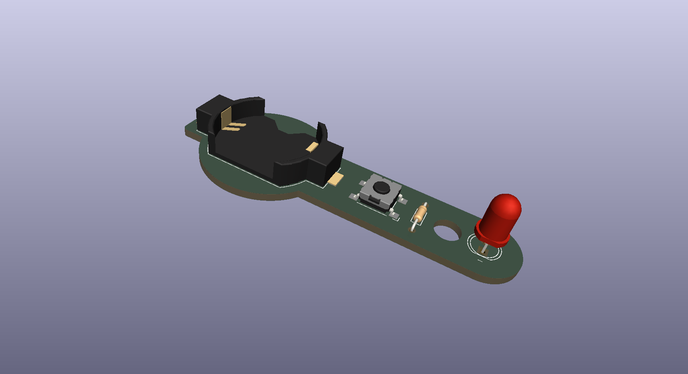
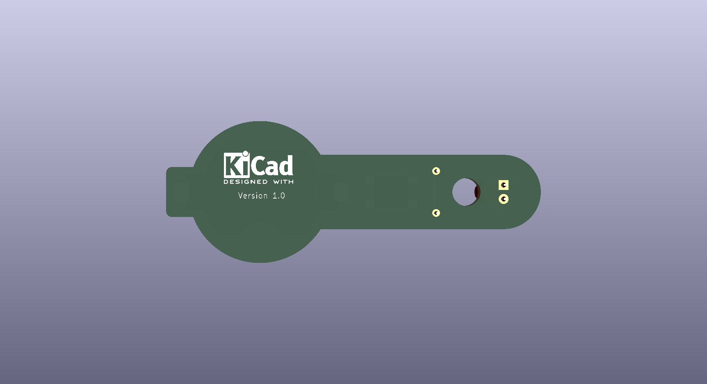

| Top | Bottom |
|---|---|
|  |  |

A minimal, no-driver LED torch circuit designed in KiCad, from schematic through PCB layout. Just a coin cell, a current-limiting resistor, an LED, and a switch.

## Features
- Coin cell powered (BT1) — no regulator or driver IC
- Single resistor (R1) sets LED current directly off the coin cell voltage
- SPST switch (SW1) for on/off
- Minimal component count, small footprint
